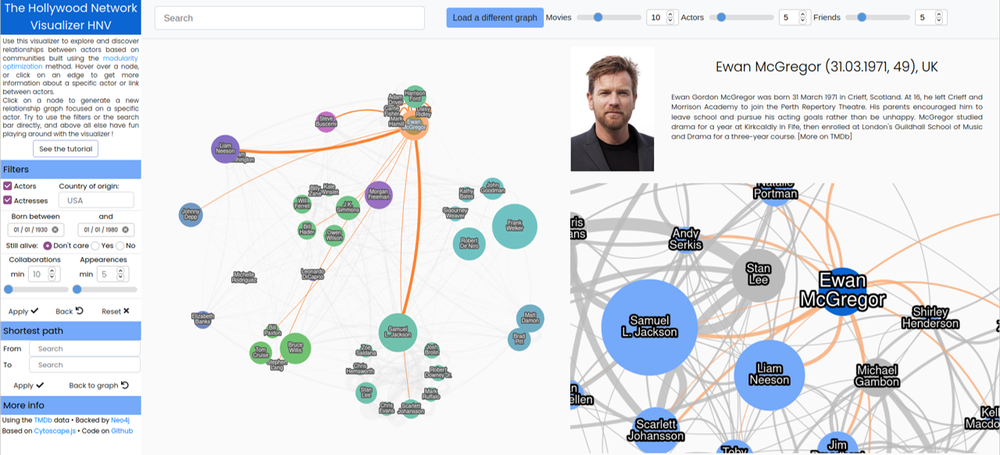

# Hollywood Network Visualizer

Graph visualization of [TMDb](https://www.themoviedb.org/) data, retrieved from API in [Rust](https://www.rust-lang.org/), backed by [Neo4j](https://neo4j.com/) database, [Akka HTTP](https://doc.akka.io/docs/akka-http/current/) backend and frontend built with [Cytoscape.js](https://js.cytoscape.org/).

Use this visualizer to explore and discover relationships between actors based on communities built using the [modularity optimization](https://neo4j.com/docs/graph-data-science/current/algorithms/modularity-optimization) method. Find the movies in which these actors starred, and navigate between dedicated graphs to jump from actors to movies, from actors to movies, from movies to actors, as long as you want.



To get this project with all submodules ([tmdb-collector](https://github.com/stevenliatti/tmdb-collector), [tmdb-to-neo4j](https://github.com/stevenliatti/tmdb-to-neo4j), [backend](https://github.com/stevenliatti/hnv-backend), [cytoscape-backend](https://github.com/stevenliatti/hnv-cytoscape-backend) and [frontend](https://github.com/stevenliatti/hnv-frontend/)) :

```bash
git clone https://github.com/stevenliatti/hollywood-network-visualizer.git --recurse-submodules
```

- [Hollywood Network Visualizer](#hollywood-network-visualizer)
  - [Running the system](#running-the-system)
    - [Dependencies](#dependencies)
    - [Deployment](#deployment)
  - [Choice of data](#choice-of-data)
  - [Intentions, message to be conveyed](#intentions-message-to-be-conveyed)
  - [Presentation choices](#presentation-choices)
    - [Representation](#representation)
    - [Interaction](#interaction)
    - [Usability](#usability)
  - [Criticism of the tools used](#criticism-of-the-tools-used)

## Running the system

### Dependencies
Developed and tested on Linux, your system need at minimum :

- tar
- wget
- docker
- docker-compose

To execute `tmdb-to-neo4j`, you have to setup Scala and sbt. To execute `tmdb-collector`, you have to setup Rust. See the documentation in each submodule.

### Deployment
Define a `.env` file in the `frontend` directory to set `API_BASE_URL`. To deploy the visualizer under `localhost`, set it as :

```
API_BASE_URL=http://localhost/api-cache
```

Run without cache :

```bash
make init
make up
```

Run with some pre-existing cache (WARNING: the cache takes up to multiple GB of data!) :

```bash
make init-with-cache
make up
```

## Choice of data

The data comes from [TMDb](https://www.themoviedb.org/), as obtained from its [API](https://developers.themoviedb.org/3/getting-started/introduction). This API gives information on movies, actors and genres in JSON format. Here you have an excerpt of movie and actor data :

```json
{
    "adult": false,
    "backdrop_path": "/fNG7i7RqMErkcqhohV2a6cV1Ehy.jpg",
    "belongs_to_collection": {
        "id": 2344,
        "name": "The Matrix Collection",
        "poster_path": "/lh4aGpd3U9rm9B8Oqr6CUgQLtZL.jpg",
        "backdrop_path": "/bRm2DEgUiYciDw3myHuYFInD7la.jpg"
    },
    "budget": 63000000,
    "genres": [
        {
            "id": 28,
            "name": "Action"
        },
        {
            "id": 878,
            "name": "Science Fiction"
        }
    ],
    "homepage": "http://www.warnerbros.com/matrix",
    "id": 603,
    "imdb_id": "tt0133093",
    "original_language": "en",
    "original_title": "The Matrix",
    "overview": "Set in the 22nd century, The Matrix tells the story of a computer hacker who joins a group of underground insurgents fighting the vast and powerful computers who now rule the earth.",
    "popularity": 54.896,
    "poster_path": "/vybQQ7w7vGvF53IsGD0y0JSgIsA.jpg",
    "production_companies": [
        {
            "id": 79,
            "logo_path": "/tpFpsqbleCzEE2p5EgvUq6ozfCA.png",
            "name": "Village Roadshow Pictures",
            "origin_country": "US"
        },
        {
            "id": 372,
            "logo_path": null,
            "name": "Groucho II Film Partnership",
            "origin_country": ""
        },
        {
            "id": 1885,
            "logo_path": "/xlvoOZr4s1PygosrwZyolIFe5xs.png",
            "name": "Silver Pictures",
            "origin_country": "US"
        },
        {
            "id": 174,
            "logo_path": "/ky0xOc5OrhzkZ1N6KyUxacfQsCk.png",
            "name": "Warner Bros. Pictures",
            "origin_country": "US"
        }
    ],
    "production_countries": [
        {
            "iso_3166_1": "AU",
            "name": "Australia"
        },
        {
            "iso_3166_1": "US",
            "name": "United States of America"
        }
    ],
    "release_date": "1999-03-30",
    "revenue": 463517383,
    "runtime": 136,
    "spoken_languages": [
        {
            "english_name": "English",
            "iso_639_1": "en",
            "name": "English"
        }
    ],
    "status": "Released",
    "tagline": "Welcome to the Real World.",
    "title": "The Matrix",
    "video": false,
    "vote_average": 8.1,
    "vote_count": 18182,
    "credits": {
        "cast": [
            {
                "adult": false,
                "gender": 2,
                "id": 6384,
                "known_for_department": "Acting",
                "name": "Keanu Reeves",
                "original_name": "Keanu Reeves",
                "popularity": 30.32,
                "profile_path": "/rRdru6REr9i3WIHv2mntpcgxnoY.jpg",
                "cast_id": 34,
                "character": "Thomas A. Anderson / Neo",
                "credit_id": "52fe425bc3a36847f80181c1",
                "order": 0
            },
            {
                "adult": false,
                "gender": 2,
                "id": 2975,
                "known_for_department": "Acting",
                "name": "Laurence Fishburne",
                "original_name": "Laurence Fishburne",
                "popularity": 5.6,
                "profile_path": "/8suOhUmPbfKqDQ17jQ1Gy0mI3P4.jpg",
                "cast_id": 21,
                "character": "Morpheus",
                "credit_id": "52fe425bc3a36847f801818d",
                "order": 1
            },
            ...
        ]
    }
}
```

```json
{
    "adult": false,
    "also_known_as": [
        "Киану Ривз",
        "키아누 리브스",
        "キアヌ・リーブス",
        "เคอานู รีฟส์",
        "基努·里维斯",
        "קיאנו ריבס",
        "Keanu Charles Reeves",
        "Κιάνου Ριβς",
        "Κιάνου Τσαρλς Ριβς",
        "Кіану Рівз",
        "كاينو ريفز",
        "كيانو ريفز"
    ],
    "biography": "Keanu Charles Reeves is a Canadian actor. Reeves is known for his roles in Bill & Ted's Excellent Adventure, Speed, Point Break, and The Matrix trilogy as Neo. He has collaborated with major directors such as Stephen Frears (in the 1988 period drama Dangerous Liaisons); Gus Van Sant (in the 1991 independent film My Own Private Idaho); and Bernardo Bertolucci (in the 1993 film Little Buddha). Referring to his 1991 film releases, The New York Times' critic, Janet Maslin, praised Reeves' versatility, saying that he \"displays considerable discipline and range. He moves easily between the buttoned-down demeanor that suits a police procedural story and the loose-jointed manner of his comic roles.\" A repeated theme in roles he has portrayed is that of saving the world, including the characters of Ted Logan, Buddha, Neo, Johnny Mnemonic, John Constantine and Klaatu.696969",
    "birthday": "1964-09-02",
    "deathday": null,
    "gender": 2,
    "homepage": null,
    "id": 6384,
    "imdb_id": "nm0000206",
    "known_for_department": "Acting",
    "name": "Keanu Reeves",
    "place_of_birth": "Beirut, Lebanon",
    "popularity": 30.32,
    "profile_path": "/rRdru6REr9i3WIHv2mntpcgxnoY.jpg",
    "movie_credits": {
        "cast": [
            {
                "id": 603,
                "vote_average": 8.1,
                "overview": "Set in the 22nd century, The Matrix tells the story of a computer hacker who joins a group of underground insurgents fighting the vast and powerful computers who now rule the earth.",
                "release_date": "1999-03-30",
                "title": "The Matrix",
                "adult": false,
                "backdrop_path": "/fNG7i7RqMErkcqhohV2a6cV1Ehy.jpg",
                "vote_count": 18181,
                "genre_ids": [
                    28,
                    878
                ],
                "video": false,
                "original_language": "en",
                "original_title": "The Matrix",
                "poster_path": "/vybQQ7w7vGvF53IsGD0y0JSgIsA.jpg",
                "popularity": 54.896,
                "character": "Thomas A. Anderson / Neo",
                "credit_id": "52fe425bc3a36847f80181c1",
                "order": 0
            },
            ...
        ]
    }
}
```

Using this information, we can build the relations between actors, movies and genres then used to create the graphs.

We proceeded as follows to recover the data:

- Retrieve all movie IDs on TMDb with the [daily file exports](https://developers.themoviedb.org/3/getting-started/daily-file-exports). This list contains about 500'000 movies.
- Keep movies with an income of more than 10 million dollars.
- Retrieve the daily file exports of actors. This list contains about 2 million actors.
- Sort this list by TMDb popularity and take the first 10'000 actors.

See [tmdb-collector](https://github.com/stevenliatti/tmdb-collector) for more details.

## Intentions, message to be conveyed

Our first target audience is the cinema enthusiasts and movie lovers. More broadly, we aim to intrigue and attract any curious user enjoying the exploration and manipulation of a dynamic visualization. As developpers, we like graphical representations, where the speaking elements are the nodes and links between them, offering representations of associations in sizes and space, not just as "simple" two-dimensional tables. We wanted to show the relationships between actors, define their strengths (how many other actors one actor knows, how often two actors know each other), and determine communities of actors. One of our inspirations was this [visualization of Twitch](https://blog.twitch.tv/en/2015/02/04/visual-mapping-of-twitch-and-our-communities-cause-science-2f5ad212c3da/) displaying their communities and their mixing or lack thereof.

The visualization is above all designed to be fun to use, offering a responsive interface and minimising wait times. If it is possible for a user to enjoy a playful exploration of the actors and movies data, and make interesting and even unsuspected discoveries, we consider our intentions met.

## Presentation choices

### Representation

Our representation takes the form of graphs, networks of nodes and edges. We have tried to follow Schneidermann's mantra:
- We present the main graph as a general view: *overview first* ;
- The user can then zoom in on it and apply filters as desired: *zoom and filter* ;
- With the help of the search bar and/or by clicking on the nodes or edges of the graph, they can access more details like actors and movies popups, a dedicated side graph to centre the view on a particular actor or movie: *details on demand*.

We have placed our buttons and controls in a standard way, always in the same places, which makes the interface pleasant for the user.

We also worked on the encoding of information, depending on the graph the user focuses on. Using colors for example, on the main graph they represent the communities computed for the actors (also encoded with spatial proximity), and on the side graph they represent the types of nodes displayed (main actor and direct relations, or differentiating between movies, actors, genres and countries). Colors are also organised in a uniform way (HSL variations from green to purple, with the whole range of blues). For another example, the size of the nodes and edges depends on the importance of the actors and the number of relationships they have with each other.

### Interaction

The interface has explicit controls (buttons have labels, etc.), the visualization evolves dynmically (popups and additional information appear depending on user mouse movement, images of actors and movies contain a link to TMDb that show up on mouse hovering). Generally speaking, we have injected a dose of "fun" into this interface: the graphs are dynamic, mouse over elements trigger events, nodes can be manipulated with the mouse, the zoom is functional, search with autocompletion, etc. In short, this interface is entertaining, meeting up with our intentions of making a visualization that offers playful/recreational exploration.

### Usability

Our interface is highly manipulable: there are filters to be applied on the main graph, buttons to launch commands, auto-completion of the search, external web links to TMDb, etc. The whole web app fits on one page (no scroll), it is intuitive and uniform, and aims to provide user satisfaction. It is organised in a hierarchical way, consistent in the visual palette, visual "noise" is avoided by highlighting the essential elements.

## Criticism of the tools used

We practiced intensive prototyping using mockups, which gave us the visual guideline to follow. Overall, we are particularly satisfied with the tools used and their functionnalities. Generally speaking our entire technical stack is solid, either thanks to our experience with the tools, or by "luck" to have chosen adapted tools, which was the case for Cytoscape.js for example. The documentation for Cytoscape.js is complete and the examples and demos are very well done. If one had to make some criticisms, however, one can see that Cytoscape.js has difficulty with large graphs, the calculation time can be long (solved thanks to our cache).
